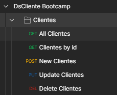

<h2 align="center">
   Client List - Java Spring Boot Bootcamp Project 0.1
</h2>

<figure>

  

</figure>

# About
This project was developed for the Java Spring Bootcamp of DevSuperior. This is the project 0.1: Case study about CRUD.

In this Spring Boot project, was studied how to create Git monorepository, organize project in layers, create entities, project profiles, database seeding, create REST web services, DTO pattern, full CRUD, exception handling, audit data and paging of data. 

Java Spring Boot Bootcamp Project 0.1

# Features
- Create Git monorepository
- Organize project in layers
- Create entities
- Project profiles
- Database seeding
- Create REST web services
- DTO pattern
- Full CRUD
- Exception handling
- Audit data and paging of data. 

## Technologies used
- STS (Spring Tool Suite)
- PostMan
- PostgreSQL 12
- PgAdmin
- PostMan

## Back end
- Java 17 
- JDK 17 ZULU
- Spring Boot
- JPA / Hibernate

## Layout
<figure>

  
    
  <figcaption>Postman Requests that this application can support</figcaption>

</figure>
 
 
<figure>

  
  <figcaption>H2 Console with DataBase information</figcaption>

</figure>
 
 

<h5 align="center">
  &copy;2023 - <a href="https://github.com/KarinaRovani/">Karina de Oliveira Rovani</a>
</h5>

